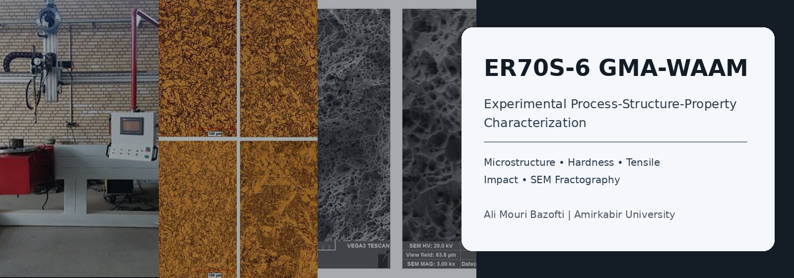
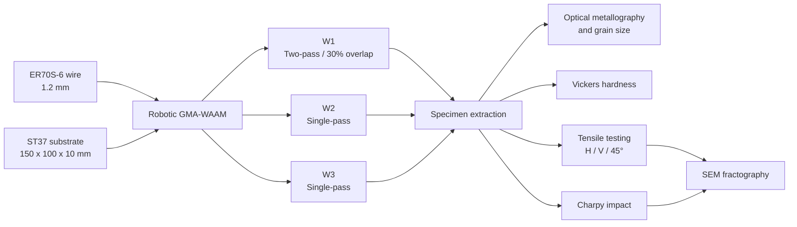
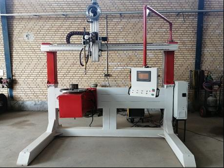
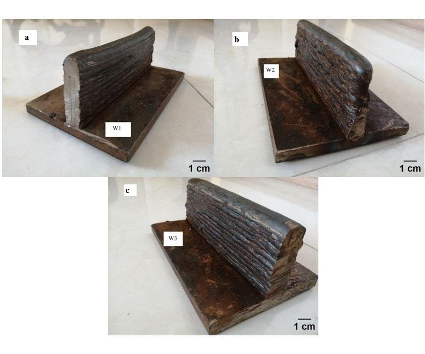
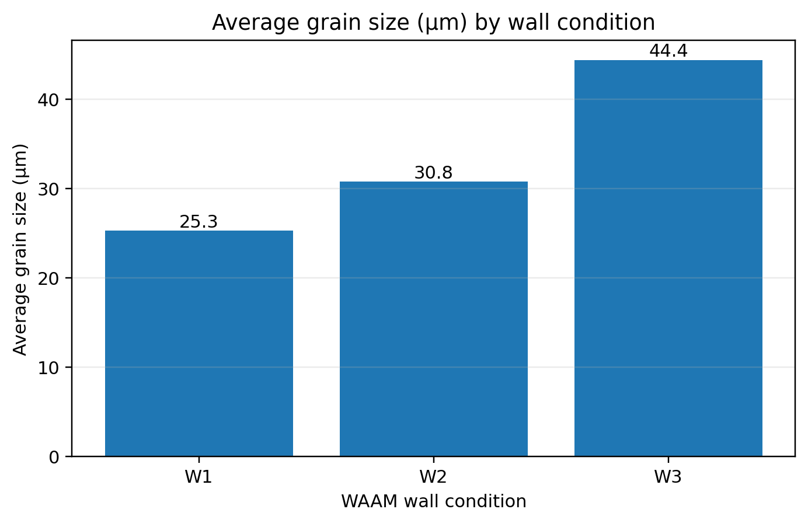
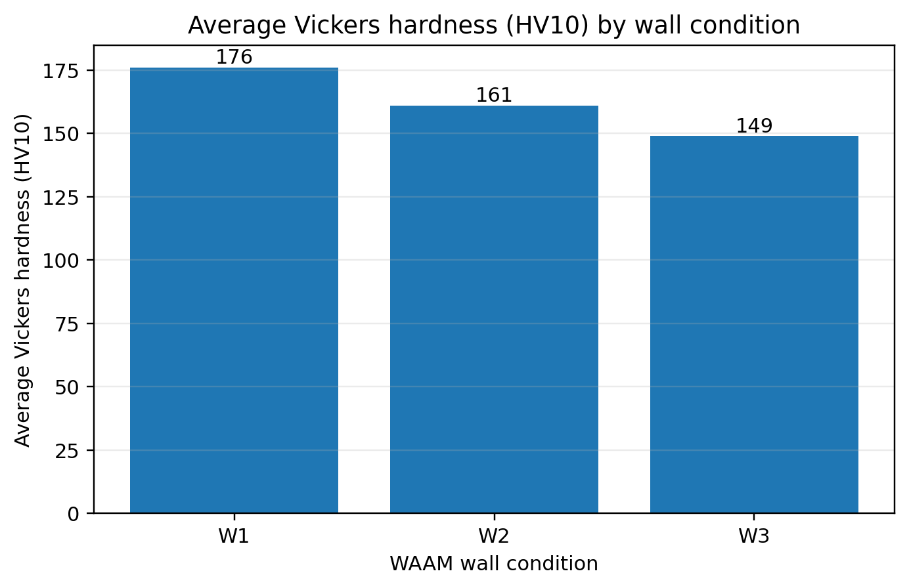
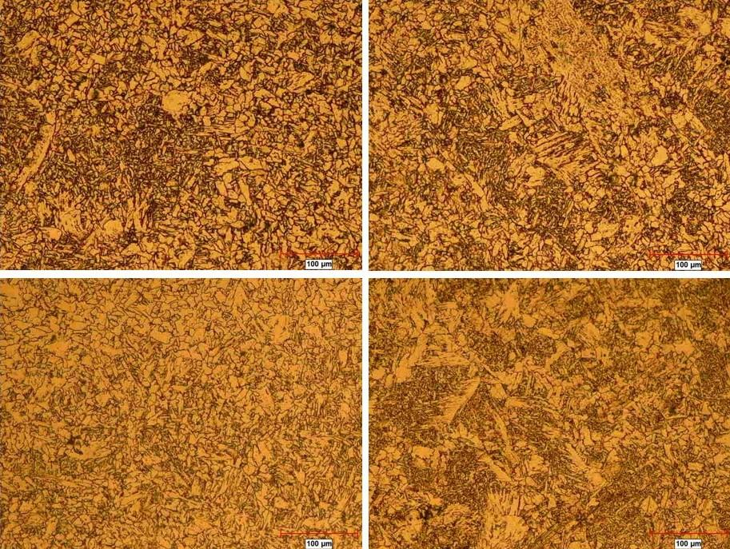
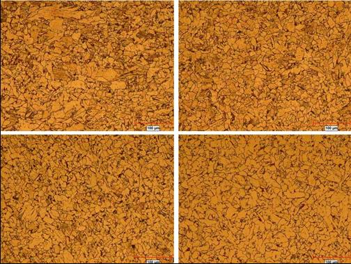
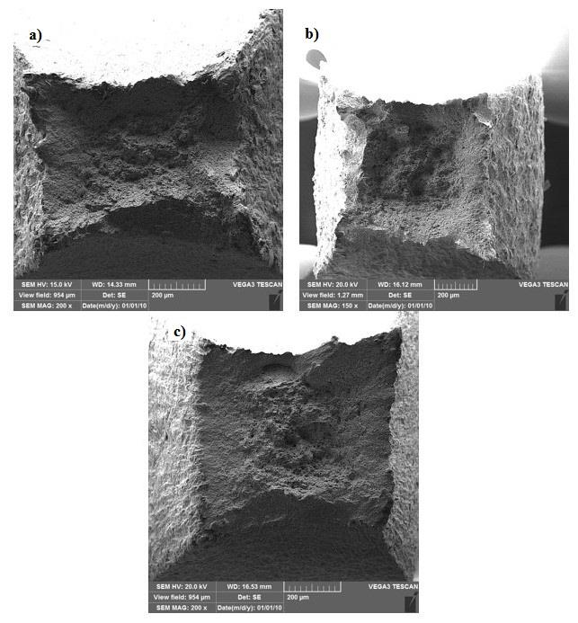
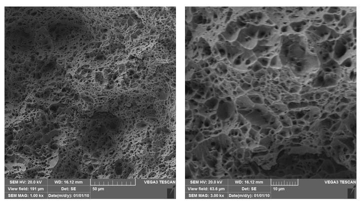

<p align="center">
  
</p>

# Experimental Process-Structure-Property Characterization of ER70S-6 Steel Produced by GMA-WAAM

[](docs/experimental_method.md)
[](data/README.md)
[](src/validate_release.py)
[](requirements.txt)

## Overview

This repository presents the **experimental branch** of a research program on low-alloy-steel wire arc additive manufacturing. Three ER70S-6 thin-wall builds were produced by robotic GMA-WAAM and characterized through optical metallography, grain-size measurement, Vickers hardness, orientation-dependent tensile testing, Charpy impact testing, and SEM fractography.

It complements the numerical repository [`WAAM-Residual-Stress-Simulation`](https://github.com/alimori165/WAAM-Residual-Stress-Simulation) by documenting the physical builds and the process-structure-property evidence used to interpret WAAM performance.

> **Scientific scope:** W1 uses a two-pass/multi-bead strategy, whereas W2 and W3 use single-pass layers. The builds are therefore treated as **combined deposition conditions** rather than a strictly one-variable heat-input experiment.

## Experimental workflow



## Experimental system

| Item | Released description |
|---|---|
| Deposition process | Robotic GMA-WAAM |
| Feedstock | ER70S-6 solid wire, 1.2 mm diameter |
| Substrate | ST37 steel, 150 x 100 x 10 mm |
| Power source | Miller Phoenix 456 |
| Motion system | Three-axis CNC WAAM platform with rotating table |
| Shielding gas | 98% Ar + 2% CO2 |
| CTWD | 12 mm |
| Interpass target | 165 °C |
| Path strategy | Alternating/back-and-forth deposition |

<p align="center">
  
  
</p>

## Conservative quantitative release

Only metrics that are internally consistent across the manuscript graphs, discussion, and conclusions are used as public numerical highlights.

| Condition | Average grain size (µm) | Average Vickers hardness (HV10) |
|---|---:|---:|
| W1 | 25.3 | 176 |
| W2 | 30.8 | 161 |
| W3 | 44.4 | 149 |

Across W1 to W3, the released summary shows a **75.5% increase in average grain size** and a **15.3% decrease in average hardness**. These observations support a coarsening-and-softening trend across the three deposition conditions without assigning the change to a single process variable.

<p align="center">
  
  
</p>

## Microstructure and fracture morphology

Representative optical micrographs show a progressively coarser ferritic morphology from W1 toward W3. The released SEM fields indicate predominantly ductile fracture morphology characterized by microvoid coalescence, dimples, and secondary cracking. Detailed phase fractions and quantitative dimple statistics are not claimed in this release.

<p align="center">
  
  
</p>

<p align="center">
  
  
</p>

## Characterization matrix

| Method | Scope | Public status |
|---|---|---|
| Optical metallography | Four wall-height zones; 10% Nital | Representative images released |
| Grain size | Heyn intercept method | Wall averages released |
| Vickers hardness | 10 kgf; five indents per zone | Wall averages released |
| Tensile testing | Horizontal, vertical, and 45-degree specimens | Raw curves and direction-resolved values pending verification |
| Charpy impact | Four room-temperature specimens per wall | Raw replicate data pending verification |
| SEM fractography | Tensile and impact fracture surfaces | Selected representative images released |

## Repository structure

```text
WAAM-ER70S6-Experimental-Characterization/
├── .github/workflows/validate.yml
├── data/
│   ├── metadata/
│   ├── processed/summary_metrics.csv
│   └── raw/
├── docs/
│   ├── experimental_method.md
│   ├── data_quality_notes.md
│   ├── figure_provenance.md
│   ├── references.md
│   └── release_checklist.md
├── figures/
│   ├── generated/
│   └── source/
├── notebooks/01_experimental_summary.ipynb
├── src/
│   ├── make_summary_figures.py
│   └── validate_release.py
├── CITATION.cff
├── DATA_USE.md
├── requirements.txt
└── README.md
```

## Reproduce the released figures

```bash
python -m venv .venv
source .venv/bin/activate          # Windows: .venv\Scripts\activate
pip install -r requirements.txt
python src/validate_release.py
python src/make_summary_figures.py --check
```

## Data-quality policy

This public version intentionally excludes unresolved or insufficiently documented quantities, including unreconciled energy-input values, orientation-specific tensile summaries, ambiguous elongation formatting, tensile-toughness units, and Charpy-derived fracture-toughness estimates. The rationale is documented in [`docs/data_quality_notes.md`](docs/data_quality_notes.md).

## Publication status

Associated manuscript: **“Microstructural Evolution and Mechanical Anisotropy in Wire Arc Additive Manufacturing of ER70S-6 Low-Alloy Steel”** - under review. The repository will be updated with the final DOI and verified raw datasets after publication and co-author approval.

## Author

**Ali Mouri Bazofti**  
M.Sc. Materials and Metallurgical Engineering (Welding)  
Amirkabir University of Technology (Tehran Polytechnic)  
Email: `A.mori@aut.ac.ir`  
GitHub: [@alimori165](https://github.com/alimori165)

Research interests: wire arc additive manufacturing, welding metallurgy, thermo-mechanical modelling, residual stress, experimental validation, and data-driven manufacturing.

## Data and image use

See [`DATA_USE.md`](DATA_USE.md). Source images originate from an unpublished/under-review manuscript and should not be redistributed without author and co-author approval.
